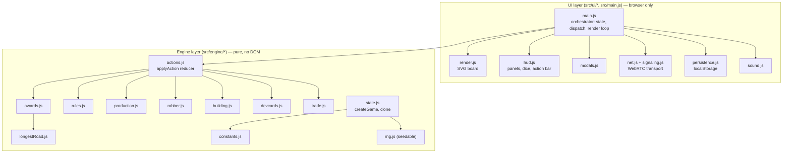
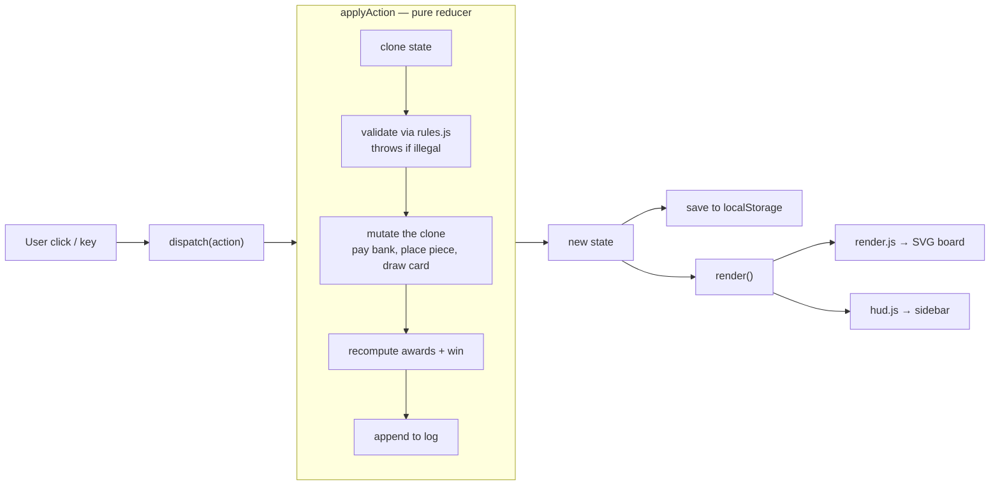
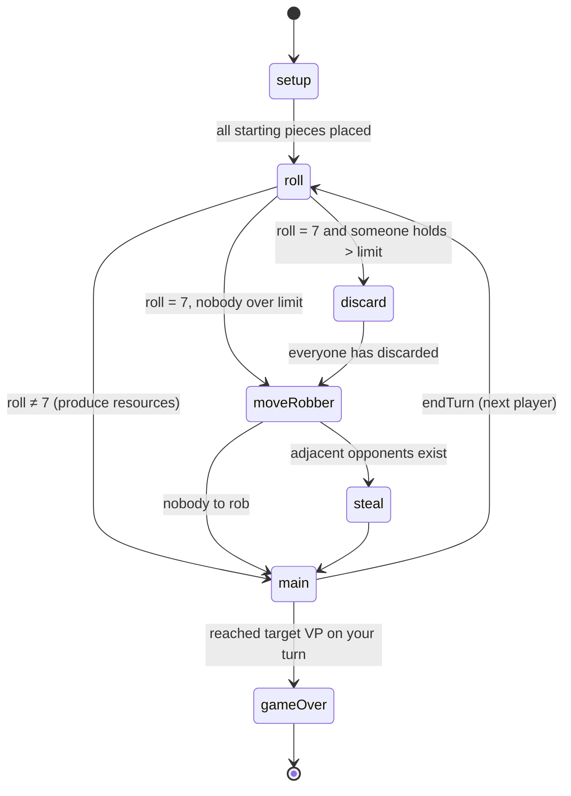
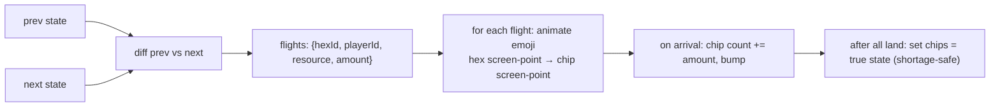
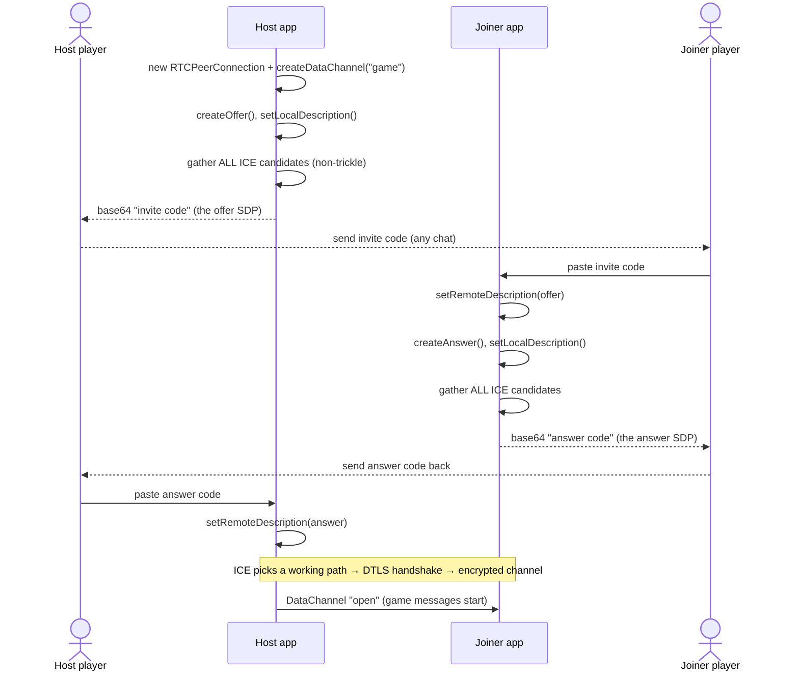
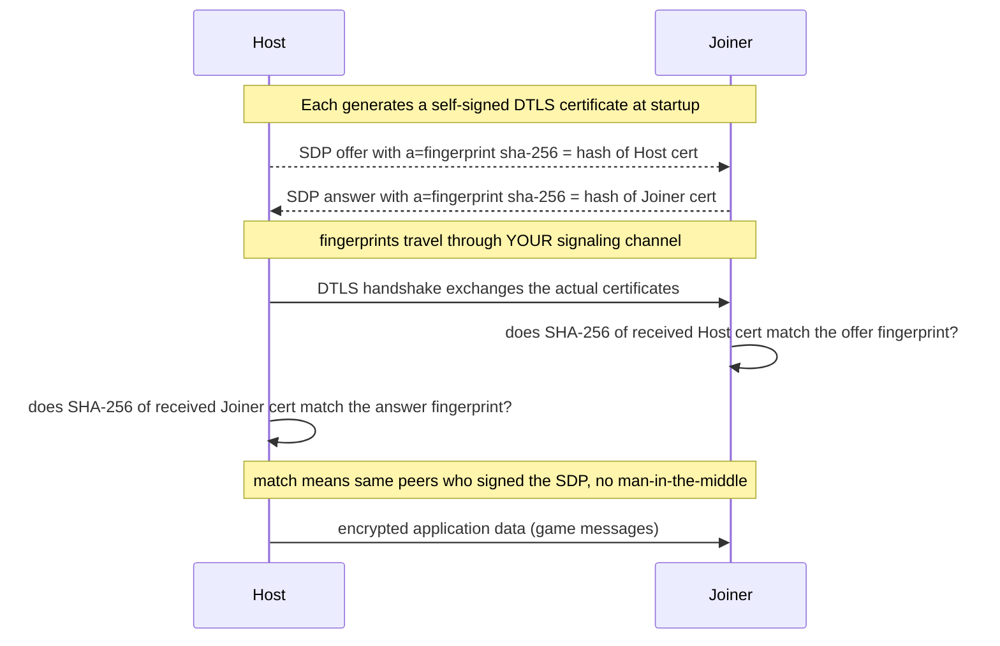
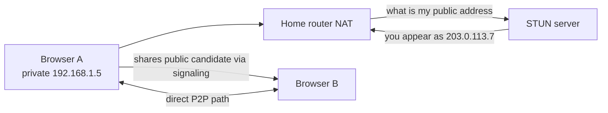
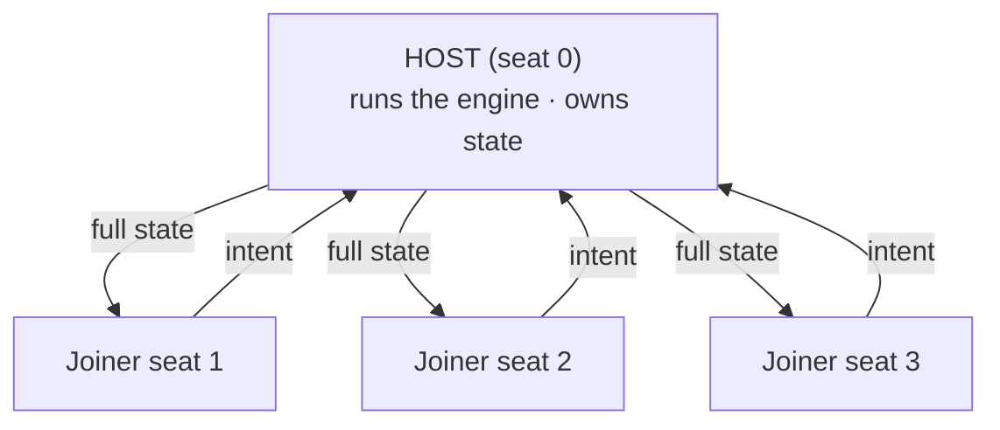
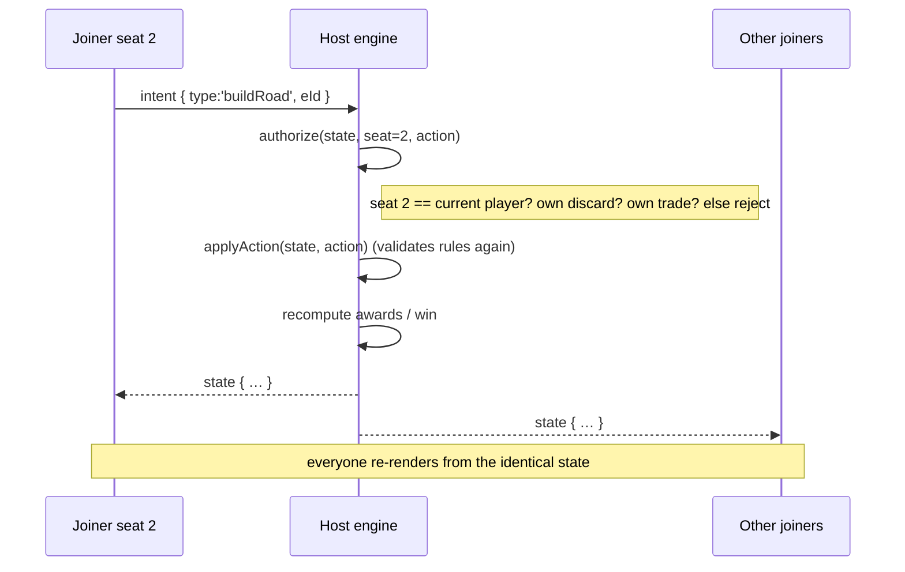
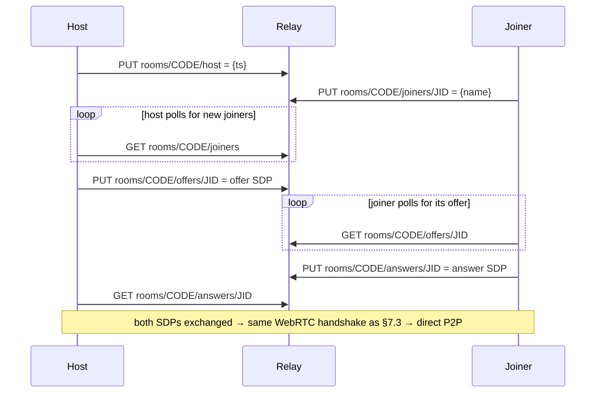

# Catan — Architecture & Data Flow

A guided tour of how this game is built and how data moves through it — from a click, to
the game engine, to the screen, and (for online play) across the network. The networking
section is deliberately thorough and defines every acronym as it appears.

> Diagrams are [Mermaid](https://mermaid.js.org/) and render automatically on GitHub.

## Contents

1. [Big picture: two layers](#1-big-picture-two-layers)
2. [The game state (single source of truth)](#2-the-game-state-single-source-of-truth)
3. [Local data flow (offline)](#3-local-data-flow-offline)
4. [The turn state machine](#4-the-turn-state-machine)
5. [Rendering & animation](#5-rendering--animation)
6. [Persistence](#6-persistence)
7. [Networking deep dive](#7-networking-deep-dive) ← WebRTC, ICE, STUN/TURN, DTLS, SHA‑256
8. [Glossary](#8-glossary-quick-reference)
9. [File map](#9-file-map)

---

## 1. Big picture: two layers

The app is split into a **pure engine** (all the rules, no browser) and a **UI** (all the
browser, no rules). The UI depends on the engine; the engine never depends on the UI.



**Why this split?** The engine is a set of pure functions with a seedable random number
generator, so it is fully deterministic and unit-tested with `node --test` (77 tests). The
UI is a thin shell that turns clicks into *actions* and state into pixels. The determinism
is also what makes online play simple (see [§7.7](#77-host-authoritative-game-sync)).

The one rule that ties it together:

> **All change happens through one function:** `applyAction(state, action) → newState`.

---

## 2. The game state (single source of truth)

There is exactly one big plain object — the **state**. Everything on screen is derived
from it. It is JSON-serializable (no functions inside), which is what lets us clone it,
save it to `localStorage`, and send it over the network verbatim.

```
state = {
  config:  { variant, targetVP, setupSettlements, bonusResources, discardLimit, playerCount, … },
  seed, rngState,          // deterministic RNG position (see below)
  board:   { hexes[19], vertices[54], edges[72], ports[9], robberHex },
  players: [ { id, name, color, resources{5}, dev[], playedKnights, pieces{…} } ],
  current,                 // whose turn (player index)
  bank:    { brick, lumber, wool, grain, ore },
  devDeck: [ … 25 cards … ],
  phase:   'setup' | 'roll' | 'discard' | 'moveRobber' | 'steal' | 'main' | 'gameOver',
  turn, dice, lastRoll, freeRoads, devPlayedThisTurn,
  pendingDiscards[], stealCandidates[], pendingTrade, setup{…},
  awards:  { longestRoad, largestArmy, … },
  winner, log[]
}
```

**Deterministic RNG (`rng.js`).** Randomness (board shuffle, dice, card draws, steals) uses
a small seeded PRNG (mulberry32). Instead of storing a live RNG object, the state stores
`rngState` (a number = the PRNG's current position). Any code that needs randomness
restores a transient RNG from `rngState`, uses it, and writes the advanced position back.
Same seed ⇒ same game, which makes tests reproducible and network sync trivial.

---

## 3. Local data flow (offline)

Strictly one-way: **event → action → new state → re-render**. There is no two-way data
binding; every change re-derives the view from state.



Key properties:

- **Immutable step:** the reducer clones (`structuredClone`) before mutating, so a rejected
  action leaves the old state untouched.
- **Validation first:** illegal moves throw; the UI only ever *offers* legal moves
  (highlighted vertices/edges), and the engine enforces the rules regardless.
- **Full re-render:** after each action the whole screen is rebuilt from the new state.
  The board is small (19 hexes) so this is cheap and keeps the UI a pure function of state.

---

## 4. The turn state machine

`state.phase` is a finite‑state machine. Actions are only valid in the right phase.



A Knight card runs the same `moveRobber → steal` sub-sequence and then returns to the phase
it was played in (that's why the robber remembers a `robberReturnPhase`).

---

## 5. Rendering & animation

`render()` rebuilds two things from state: the **SVG board** (`render.js`) and the
**sidebar HUD** (`hud.js`). It also passes one-shot *animation hints* computed by diffing
the previous and next state (`diffAnim`): which piece was just placed (pop), which road
(draw-in), whether the robber moved (hop), which hexes produced (pulse).

The **flying-resource animation** is a good example of UI/engine separation. The engine
just updates counts. The UI diffs the two states, figures out which hex produced which
resource for whom, and animates an emoji from the hex's on-screen position to the player's
resource chip, ticking the count up on arrival — then reconciles to the true state value.



Hex screen positions come from `svg.getScreenCTM()` (the SVG→pixel matrix); chip positions
from `getBoundingClientRect()`.

---

## 6. Persistence

Offline games autosave to `localStorage` after every action (`persistence.js`) and offer
**Resume** on load. Online games are not saved (the host is the source of truth and
connections can't be restored from disk). Theme and mute are stored as small local
preferences so each device keeps its own.

---

## 7. Networking deep dive

This is the part worth understanding well. Online play is **peer‑to‑peer over WebRTC** —
browsers talk directly to each other, with no game server in the middle. That's the only
option here, because the site is hosted on **GitHub Pages**, which serves *static files
only* (no backend to run).

### 7.1 The vocabulary (read this first)

| Term | What it is, in one line |
| --- | --- |
| **WebRTC** | A browser API for direct **peer-to-peer** audio/video/**data** between two browsers, with no server in the data path. |
| **RTCPeerConnection** | The object that manages one P2P link — connectivity, encryption, transport. |
| **RTCDataChannel** | A two-way message pipe over that link. We send JSON game messages on it. |
| **SDP** (Session Description Protocol) | A text blob describing the connection: what's being sent, network **candidates**, and the crypto **fingerprint**. |
| **Offer / Answer** | The two-step handshake: caller makes an **offer** (an SDP), callee replies with an **answer** (an SDP). |
| **Signaling** | The out-of-band way the offer and answer get from one peer to the other. WebRTC does **not** define this — you pick it (we copy/paste, or use a relay). |
| **ICE** (Interactive Connectivity Establishment) | The algorithm that discovers network paths and picks one that works. |
| **ICE candidate** | A possible address to reach a peer: **host** = a local IP, **srflx** = public IP via STUN, **relay** = via TURN. |
| **NAT** (Network Address Translation) | Your router sharing one public IP across many private devices. It's why two peers can't just "dial" each other directly. |
| **STUN** (Session Traversal Utilities for NAT) | A tiny public server that tells your browser *"here's how the internet sees your IP:port"*, so peers behind NAT can often connect directly. |
| **TURN** (Traversal Using Relays around NAT) | A relay server that forwards the traffic when a direct path is impossible (e.g. strict/symmetric NAT on cellular). |
| **mDNS** (multicast DNS) | Browsers hide your real local IP behind a random `xxxx.local` name resolved on the LAN — a privacy feature; works fine on the same network. |
| **Trickle ICE** | Sending candidates one-by-one as they're found. We use **non-trickle** (wait for all, emit one code) so a single connect code is self-contained. |
| **DTLS** (Datagram Transport Layer Security) | TLS for datagrams. It **encrypts** the WebRTC transport. It is mandatory in WebRTC — there is no unencrypted mode. |
| **SHA-256** | A cryptographic hash. The SDP's `fingerprint` line is the SHA-256 of the peer's DTLS certificate; comparing it prevents a man-in-the-middle. |
| **SCTP** (Stream Control Transmission Protocol) | The protocol data channels run over (inside DTLS), giving reliable, ordered messages. |
| **base64** | Text encoding of bytes, so the SDP can be pasted as one line of characters. |

### 7.2 The core problem: two browsers can't find each other

Both players sit behind home routers doing **NAT**, so neither has a directly-dialable
address. WebRTC solves the *media* path itself (via ICE), but it needs *you* to shuttle the
first two messages (**offer** and **answer**) between the peers. That shuttling is
**signaling**, and it's the only thing WebRTC leaves up to the app.

This game offers two signaling methods:

- **Copy/paste (default, no server):** the offer/answer SDP is base64-encoded and the
  players paste it to each other. Zero infrastructure — works on GitHub Pages as-is.
- **Short room code (optional, needs a relay):** a tiny key-value service stores the SDP
  under a 9-letter code so players just type the code. Requires a signaling backend.

### 7.3 Connecting, step by step (copy/paste mode)

We use **non-trickle ICE** (`waitForIce` in `net.js`): create the offer/answer, wait until
ICE has gathered *all* candidates, then serialize the finished SDP once. That's why a single
pasted code is enough — it already contains the network candidates.



`enc`/`dec` in `net.js` are just `base64(JSON.stringify(sessionDescription))` and back.

### 7.4 What's actually inside a connect code

A connect code is `base64( { "type": "answer", "sdp": "…" } )`. Decoded, the SDP is a few
lines of plain text. Annotated:

```
v=0
o=- 6607460182313246182 2 IN IP4 127.0.0.1     ← origin (session id)
s=-                                            ← session name (unused)
t=0 0
a=group:BUNDLE 0
m=application 9 UDP/DTLS/SCTP webrtc-datachannel  ← "a data channel, over SCTP, over DTLS, over UDP"
c=IN IP4 0.0.0.0
a=candidate:… udp … 80fb2412-…​.local 55510 typ host …  ← an ICE candidate (mDNS host name + port)
a=candidate:… udp … 6acba46c-…​.local 58707 typ host …
a=ice-ufrag:L+yr                               ← ICE username fragment  ┐ short-lived creds that
a=ice-pwd:0gZgRBDP3Y3e+y8rxg9sJmVl             ← ICE password           ┘ authenticate ICE checks
a=ice-options:trickle
a=fingerprint:sha-256 EF:DA:48:69:C6:31:…:0E   ← SHA-256 hash of THIS peer's DTLS certificate
a=setup:active                                 ← who starts the DTLS handshake
a=mid:0
a=sctp-port:5000
a=max-message-size:262144
```

So the code is ~1 KB of mostly-random data: an encryption **fingerprint** (a 256-bit hash),
short-lived ICE credentials, and network **candidates**. **This is why a "9-letter code"
is impossible without a relay** — that 1 KB can't be compressed to 9 characters; a short
code only works if a server stores the blob and hands it back by code.

### 7.5 Encryption: why P2P is end-to-end secure

WebRTC has no unencrypted mode. The data channel is **SCTP over DTLS**, and the DTLS keys
are verified using the **SHA-256 fingerprint** carried in the SDP:



**In short:** the fingerprint in the connect code binds the encryption to the exact peer
you exchanged codes with. An attacker who intercepted the media path can't substitute their
own certificate, because its SHA-256 wouldn't match the fingerprint. The game bytes are
encrypted end-to-end between the two browsers; no server (not even a relay) sees them.

### 7.6 Which setups can connect? (STUN / TURN)

With no STUN/TURN configured (the default, `ICE_SERVERS = []`), only **host** candidates
are usable — i.e. peers must be on the **same local network**.

| Setup | Connects by default? | Needs |
| --- | --- | --- |
| Same Wi-Fi | ✅ | nothing |
| One phone's **hotspot**, other **joins it** | ✅ (same network) | nothing |
| Home Wi-Fi ↔ different home Wi-Fi | ❌ | **STUN** |
| Wi-Fi ↔ **cellular** (symmetric NAT) | ❌ | **TURN** (relay) |

How STUN helps a NAT'd peer learn its public address:



STUN/TURN are external services, so they're **off by default** (configurable via
`ICE_SERVERS` in `net.js`, or `?ice=`), and enabling them may require the org's External
Service Review. See the README.

### 7.7 Host-authoritative game sync

Once channels are open, the game runs **host-authoritative** in a **star topology**: every
joiner connects only to the host; the host owns the one true state and relays it.



Message types on the data channel (all JSON):

| Message | Direction | Meaning |
| --- | --- | --- |
| `hello {name}` | joiner → host | I've connected; here's my name |
| `welcome {seat}` | host → joiner | You are seat N |
| `intent {action}` | joiner → host | Please apply this action for me |
| `state {state}` | host → all | Here is the new authoritative state — render it |

A move made by a **joiner** never touches its own state directly; it asks the host:



Two safeguards make this robust:

- **Authorization (`authorize`):** the host checks the *sender's seat* is allowed to do the
  action (turn actions require it's your turn; `discard` must be your own; a trade response
  must be the addressed player). This stops a client acting out of turn or for someone else.
- **The engine is the referee:** even after authorization, `applyAction` re-validates every
  rule. Clients are just input devices + renderers.

Because the host does *all* the randomness and everyone renders the same broadcast state,
clients can never diverge — there's nothing to keep in sync beyond "here's the latest
state." Hidden information is preserved in the UI: each client reveals only its own hand and
doesn't show opponents' hidden victory-point cards.

### 7.8 Optional signaling relay (short room codes)

When a relay URL is configured, the copy/paste step is automated through a small REST
key-value store (Firebase Realtime Database's `${base}/${path}.json` shape, or the bundled
`signaling-server.js`). The SDP blobs are parked under the room code and polled for:



The relay only ever sees the SDP handshake blobs — never the game traffic, which is the
direct, DTLS-encrypted P2P channel.

---

## 8. Glossary (quick reference)

- **Action** — a plain object like `{ type:'buildRoad', eId:12 }`; the only way to change state.
- **Reducer** — `applyAction(state, action)`; validates + produces the next state.
- **PRNG / seed** — pseudo-random generator; same seed ⇒ same sequence ⇒ reproducible games.
- **FSM** — finite-state machine; `state.phase` gates which actions are legal.
- **WebRTC / RTCPeerConnection / RTCDataChannel** — browser P2P connection + message pipe.
- **SDP** — the text description of a connection (offer/answer).
- **Signaling** — how offer/answer reach the other peer (copy-paste or a relay here).
- **ICE / candidate** — path discovery / a specific address to try (host, srflx, relay).
- **NAT** — routers sharing one public IP; the reason direct connections are hard.
- **STUN** — "what's my public address?" server; enables most direct connections.
- **TURN** — relay server for when direct is impossible (e.g. cellular/symmetric NAT).
- **mDNS** — `*.local` names that hide local IPs; fine on the same network.
- **DTLS** — mandatory encryption for the WebRTC transport.
- **SHA-256 fingerprint** — hash of the DTLS cert in the SDP; verifies the peer, blocks MITM.
- **SCTP** — reliable, ordered message transport the data channel runs on.
- **Host-authoritative** — one peer runs the engine and broadcasts state; others send intents.
- **Star topology** — everyone connects to the host, not to each other.

---

## 9. File map

| Path | Responsibility |
| --- | --- |
| `src/engine/constants.js` | Base-game numbers, variants, colors |
| `src/engine/rng.js` | Seedable PRNG (mulberry32) |
| `src/engine/board.js` | Hex grid → 19 hexes / 54 vertices / 72 edges / 9 ports |
| `src/engine/state.js` | `createGame`, clone, RNG helpers |
| `src/engine/rules.js` | Legality checks + legal-move enumeration |
| `src/engine/actions.js` | `applyAction` reducer + setup actions |
| `src/engine/production.js` | Dice roll → resource production |
| `src/engine/robber.js` | Discard / move robber / steal |
| `src/engine/building.js` | Build road / settlement / city |
| `src/engine/devcards.js` | Buy + play development cards |
| `src/engine/trade.js` | Bank + player trades, endTurn |
| `src/engine/longestRoad.js` | Longest-road graph search |
| `src/engine/awards.js` | Longest Road / Largest Army, scoring, win |
| `src/ui/render.js` | SVG board rendering |
| `src/ui/hud.js` | Sidebar: panels, dice, action bar, costs, log |
| `src/ui/modals.js` | Trade / discard / dev / win dialogs |
| `src/ui/net.js` | WebRTC transport (offer/answer, data channel) |
| `src/ui/signaling.js` | Optional short-room-code relay client |
| `src/ui/persistence.js`, `themes.js`, `sound.js` | Local save, theming, sound |
| `src/main.js` | Orchestrator: state, dispatch, render, online glue, lobbies |
| `signaling-server.js` | Optional self-hostable relay (no third party) |
